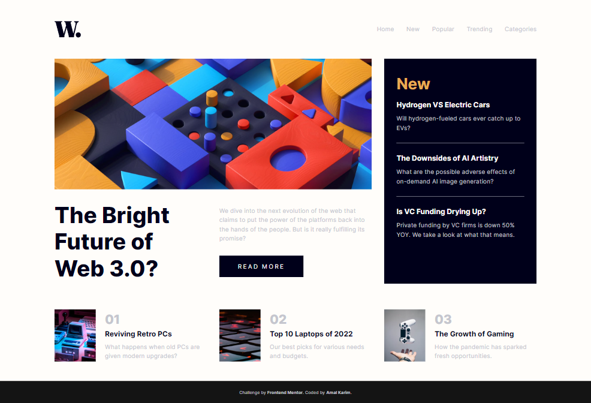

# Frontend Mentor - News homepage solution

This is a solution to the [News homepage challenge on Frontend Mentor](https://www.frontendmentor.io/challenges/news-homepage-H6SWTa1MFl). Frontend Mentor challenges help you improve your coding skills by building realistic projects. 

## Table of contents

- [Overview](#overview)
  - [The challenge](#the-challenge)
  - [Screenshot](#screenshot)
  - [Links](#links)
- [My process](#my-process)
  - [Built with](#built-with)
- [Author](#author)

## Overview

### The challenge

Users should be able to:

- View the optimal layout for the interface depending on their device's screen size
- See hover and focus states for all interactive elements on the page
- **Bonus**: Toggle the mobile menu (requires some JavaScript)

### Screenshot

### Links

- [Solution URL](https://github.com/amalkarim/fm-news-homepage)
- [Live Site URL](https://amalkarim.github.io/fm-news-homepage)

## My process

### Built with

- Semantic HTML5 markup
- [Reset CSS](https://piccalil.li/blog/a-modern-css-reset/https://piccalil.li/blog/a-modern-css-reset/)
- CSS custom properties
- Flexbox
- CSS Grid
- Mobile-first workflow
- JQuery

**Note: These are just examples. Delete this note and replace the list above with your own choices**

## Author

- Frontend Mentor - [@amalkarim](https://www.frontendmentor.io/profile/amalkarim)